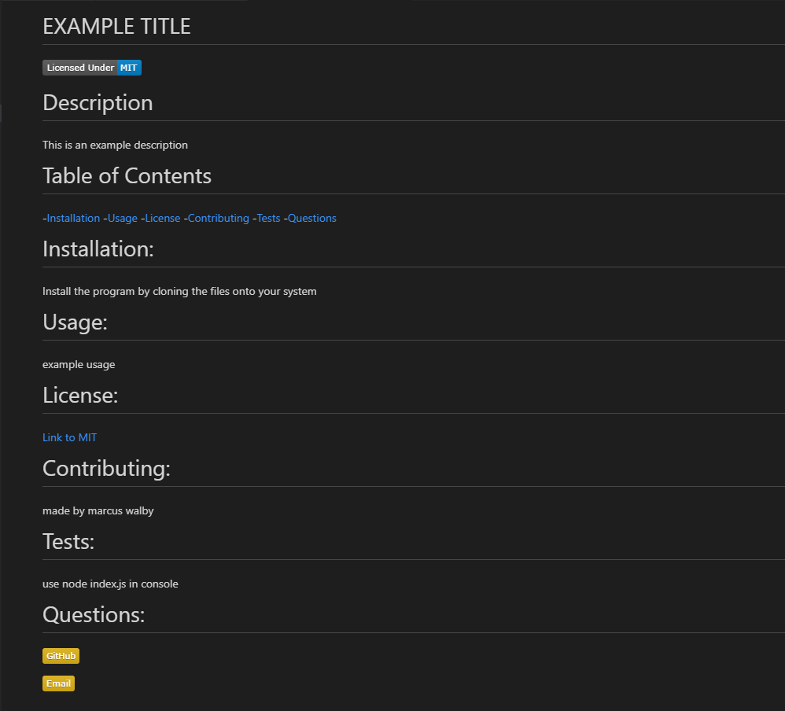

# README generator
# Description 
This program can be used to create profesinal looking  README without the hassel of styling it yourself
#  How To Use
1. Clone the files to your local system
2. Open an integrated terminal in VSC
3. Type the command 'node index.js'
4. Fill out the form and your README will be ready.

# Example of finished product

# Links

[Video of how to use site](https://www.youtube.com/embed/ECWPm1zv_WM)